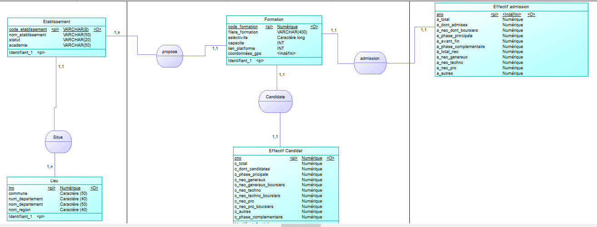

*Présenté par : Benjamin Sere, Alexandre leGrand*

*Edité le: [19/04/2024]*


# Rapport BDD  

# Exercice 1 :      

## Q1. Analyse du fichier récupéré    

1. Combien y-a t-il de lignes ?   
```bash
wc -l res/fr-esr-parcoursup.csv
```

Il y a 13870 lignes avec l'entête.

2. Que représente une ligne ?  

Chaque ligne représente une formation d'un établissement supérieur avec les différentes informations la concernant.


3. Combien y-a t-il de colonnes ?

Il y a 118 colonnes, via notre programme java nbColonnes.java :
```java
import java.io.BufferedReader;
import java.io.FileInputStream;
import java.io.IOException;
import java.io.InputStreamReader;

public class nbColonnes {
    public static void main(String[] args) {
        try {
            String filePath = "res/fr-esr-parcoursup.csv";
            BufferedReader reader = new BufferedReader(new InputStreamReader(new FileInputStream(filePath), "UTF-8"));
            String firstLine = reader.readLine();
            reader.close();
            //La variable s contient la 1ère ligne du fichier csv soit head -n 1 fr-esr-parcoursup.csv
            String res = "";
            int cpt = 0;
            int start = 0;
            for(int i = 0;i<firstLine.length();i++){
                if(firstLine.charAt(i) == ';' || i == firstLine.length()-1){
                    cpt++;
                    res = firstLine.substring(start, i);
                    start = i + 1;
                    System.out.println(cpt + " : " +res + "\n");
                }
            }
            System.out.println("Nombre de colonnes :  " + cpt);     
        } catch (IOException e) {
            e.printStackTrace();
        }
    }
}
``` 


4. Quelle colonne identifie un établissement ? (numéro et nom de col)

La 3ème colonne identifie le code UAI de l'établissement.


5. Quelle colonne identifie une formation ? (numéro et nom de col) ?

La colonne 10 identifie la filière, cependant la colonne 110 identifie via numéro unique la filière et l'établissement, donc la formation.


6. Combien de lignes font référence à notre BUT Informatique ?  
```bash
cat fr-esr-parcoursup.csv | grep "Institut universitaire de technologie de Lille - Université de Lille" | grep "BUT - Informatique" |wc -l 
``` 
Une seule ligne y fait référence pour les raisons expliquée plus haut.


7. Quelle colonne identifie un département ? (numéro et nom)   

La colonne numéro 5 nommée "Code départementale de l'établissement"
  

8. Comment envisagez vous importer ces données ?

Nous allons importer ces données via la commande :
```sql
\copy import FROM res/fr-esr-parcoursup.csv DELIMITER ';' csv header
```
Tout d'abord toutes les données seront dans une seule grande table puis nous allons tout ventiler dans différentes tables.


9. Quels problèmes identifiez vous dans ces données initiales ? (il y en a surement plusieurs, expliquez les clairement)

Il y a des redondances ainsi que des cases à null.   

## Q2. Importer les données

1. Fournir un fichier dico.xls permettant la correspondance entre les numéros de colonnes et les noms du fichier
initial. Expliquez comment vous vous y êtes pris pour le constituer.  

Pour constituer ce fichier, nous avons fait un programme pour insérer dans un csv la 1ère ligne du fichier (les noms des colonnes) puis sur la ligne d'en dessous, nous avons fait un compteur automatique.


2. Créer une table import permettant l’importation de ces données (fournir le code)  


3. S’assurer que les types de colonnes soient les plus restrictifs possibles (des int pour les colonnes contenant des
entiers, des char(x) pour les données textuelles de taille x etc ...)

```sql
CREATE TABLE import (
n1 int, n2 VARCHAR(40), n3 CHAR(8), n4 VARCHAR(200), n5 VARCHAR(3), n6 VARCHAR(30), n7 VARCHAR(40), n8 VARCHAR(30),
n9 VARCHAR(40), n10 VARCHAR(400),n11 VARCHAR(30), n12 VARCHAR(20), n13 VARCHAR(400), n14 VARCHAR(200), n15 VARCHAR(200), 
n16 VARCHAR(300), n17 VARCHAR(40), n18 int, n19 int, n20 int, n21 int,
n22 int, n23 int, n24 int, n25 int, n26 int, n27 int, n28 int,
n29 int, n30 int, n31 int, n32 int, n33 int, n34 int, n35 int,
n36 int, n37 int, n38 int, n39 int, n40 int, n41 int, n42 int,
n43 int, n44 int, n45 int, n46 int, n47 int, n48 int, n49 int,
n50 int, n51 FLOAT, n52 FLOAT, n53 FLOAT, n54 int, n55 int, n56 int,
n57 int, n58 int, n59 int, n60 int, n61 int, n62 int, n63 int,
n64 int, n65 int, n66 FLOAT, n67 int, n68 int, n69 int, n70 int,
n71 int, n72 int, n73 int, n74 FLOAT, n75 FLOAT, n76 FLOAT, n77 FLOAT,
n78 FLOAT, n79 FLOAT, n80 FLOAT, n81 FLOAT, n82 FLOAT, n83 FLOAT, n84 FLOAT,
n85 FLOAT, n86 FLOAT, n87 FLOAT, n88 FLOAT, n89 FLOAT, n90 FLOAT, n91 FLOAT,
n92 FLOAT, n93 FLOAT, n94 FLOAT, n95 FLOAT, n96 FLOAT, n97 FLOAT, n98 FLOAT,
n99 FLOAT, n100 FLOAT, n101 FLOAT, n102 VARCHAR(50), n103 FLOAT, n104 VARCHAR(50), n105 FLOAT,
n106 VARCHAR(50), n107 FLOAT, n108 VARCHAR(60), n109 VARCHAR(30), n110 int, n111 VARCHAR(100), n112 VARCHAR(200), 
n113 FLOAT, n114 FLOAT, n115 FLOAT, n116 FLOAT, n117 VARCHAR(6), n118 VARCHAR(5));
```  


4. Remplir cette table avec les données récupérées (fournir le code)  

```sql
\copy import FROM fr-esr-parcoursup.csv DELIMITER ';' csv header
```


5. En s’appuyant sur la table import fournir les requêtes et les réponses qui permettent de savoir
(a) Combien il y a de formations gérés par ParcourSup ?  
```sql
SELECT COUNT(*) AS nb_formations FROM import;
```
13869

(b) Combien il y a d’établissements gérés par ParcourSup ?   
```sql
SELECT COUNT(DISTINCT n3) AS nb_etablissements FROM import;
```
3602

(c) Combien il y a de formations pour l’université de Lille ?   
```sql
SELECT COUNT(*) AS nb_formations_lille FROM import WHERE n4 LIKE '%Université de Lille%';
```
146

(d) Combien il y a de formations pour notre IUT ?   
```sql
SELECT COUNT(*) AS nb_formations_iut FROM import WHERE n4 = 'Institut universitaire de technologie de Lille - Université de Lille';
```
10

(e) Quel est le code du BUT Informatique de l’unversité de Lille ?  
```sql
SELECT n110 AS code_formation FROM import WHERE n4 = 'Institut universitaire de technologie de Lille - Université de Lille' AND n10 = 'BUT - Informatique';
```
6888

(f) Citez 5 colonnes contenant des valeurs nulles  

Les colonnes n104, n105, n106, n107 et n111.


# Exercice 2 :

## Q1. Normalisation des données

1. Voici notre MCD : 


Nous avons choisi de créer 5 tables, premièrement une table Département pour référencer les départements et les régions. Ensuite nous avons une table Etablissement qui référence les différents établissements supérieurs avec leur statut et l'académie au quel ils sont rattachés. Enfin nous avons une table Formation qui contient toutes les informations relatives aux formations. 
Afin de séparer les données par thème, nous avons décidé de sortir des données présentes dans Formation et créer une table EffectifCandidat et une table EffectifAdmis. Ceux-ci sont reliés à la table Formation par une relation 1,1.

## Q2. La taille des fichiers

1. Quelle taille en octet fait le fichier récupéré ?  
```bash  
du --bytes fr-esr-parcoursup.csv
```  
12409201 octets
2. Quelle taille en octet fait la table import ?
```sql  
SELECT pg_total_relation_size('import')/8
```
16531456 octets
3. Quelle taille en octet fait la somme des tables créées ?
```sql  
SELECT (pg_total_relation_size('Lieu') + pg_total_relation_size('Formation') + 
pg_total_relation_size('Etablissement') +
pg_total_relation_size('EffectifCandidat') + 
pg_total_relation_size('EffectifAdmission'))
```

4. Quelle taille en octet fait la somme des tailles des fichiers exportés correspondant à ces tables ?
```sql  

```  

# Exercice 3 :


